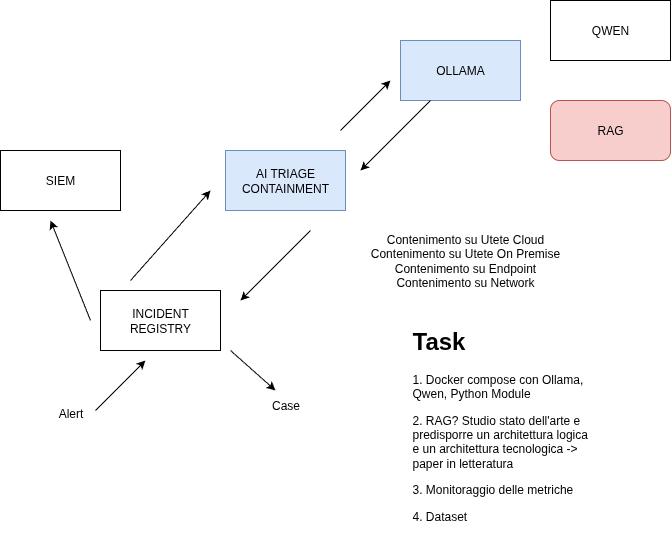

# Agentic AI - Autonomous Cyber-Response framework

## Tasks
- Sviluppo degli AI Agents per l'ingestion, l'interpretazione e la classificazione degli eventi di sicurezza EDR.
- Sviluppo e integrazione delle logiche di orchestrazione con le API XDR per l'esecuzione automatizzata del contenimento.

## Obiettivi
- Analizzare in tempo reale gli alert EDR tramite AI Agents per valutare accuratamente la criticità delle minacce.
- Ridurre drasticamente il MTTR neutralizzando gli attacchi attraverso azioni di contenimento autonome via XDR.

